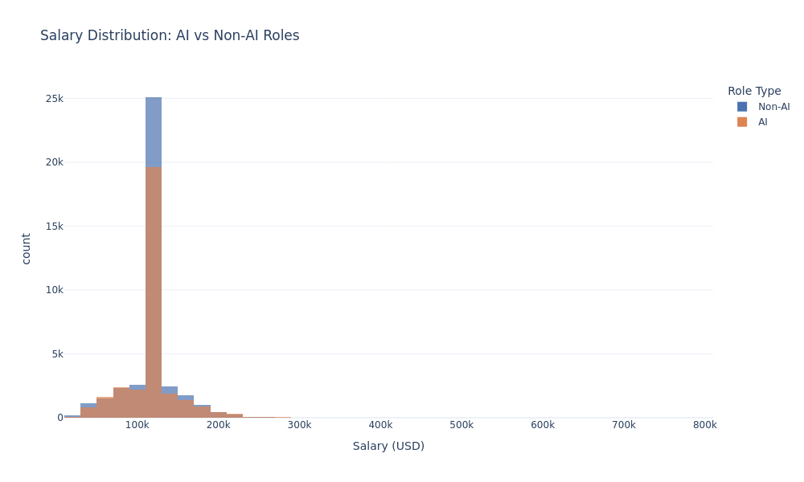
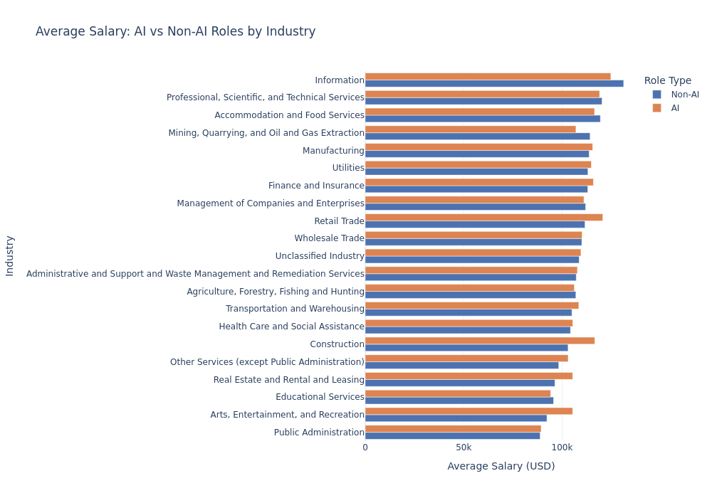
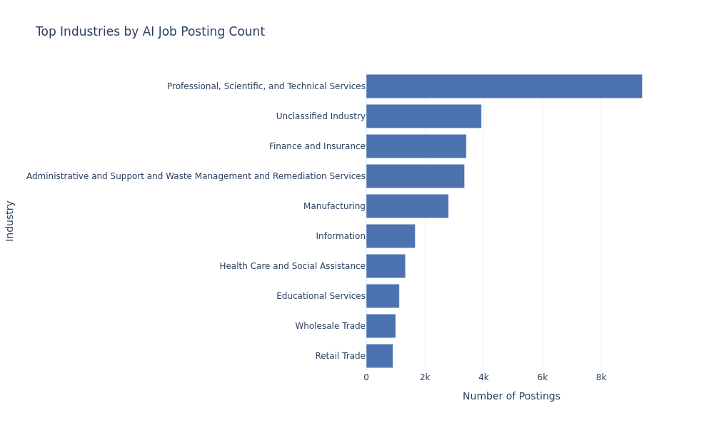

## Overview

Before building any models, we explored the Lightcast job postings dataset to understand the underlying patterns in salary, industry composition, and AI-related job demand. This section summarizes what the data revealed about how AI roles compare to non-AI roles across key dimensions.

All analysis is based on the cleaned dataset of 70,892 job postings.

## Defining AI vs Non-AI Roles

To distinguish AI-related jobs from the rest of the dataset, we flagged any posting where the job title or skills field contained keywords such as "ai", "machine learning", "artificial intelligence", "deep learning", "data science", "nlp", "llm", or "neural network".

This produced 31,857 AI-related postings (approximately 45% of the dataset) and 39,035 non-AI postings (approximately 55%). The near-even split suggests that AI-related roles have moved well beyond a niche segment of the labor market.

## Salary Distribution: AI vs Non-AI

The first question we investigated was whether AI roles simply pay more. The overall pattern suggests they do not, at least not uniformly.

Both distributions peak near $112,500 and follow a similar right-skewed shape. The two groups overlap substantially, which indicates that holding an AI-related title does not automatically translate into higher compensation. The relationship between AI and salary appears to be more complex than a simple premium.

## Average Salary by Industry: AI vs Non-AI

Breaking salary down by industry reveals a more nuanced picture. Certain industries show a meaningful AI salary premium, including Arts and Entertainment (approximately +$13,000), Construction (approximately +$13,500), and Retail Trade (approximately +$9,000). In these fields, AI skills remain relatively uncommon, and compensation reflects that scarcity.

In contrast, the Information industry pays AI roles less on average than non-AI roles. Interestingly, "working in an occupation that is considered high skill increases the odds of job loss to AI" [@Dahlin2023]...especially for the "middle-skill employees in the technological landscape" [@dahlin2023]. Arguably, the high-skill employes can pivot using tools and higher levels of resources and knowledge to adapt to the shifting environment which does not appear to directly impact salary until it is considered that the majority of the middle-skill employees will must either transition to another field or be entirely displaced.  This apparent stability of salary is likely because of the traditional IT and enterprise infrastructure roles in that sector already commanding high salaries, making AI titles less financially distinctive by comparison due to the stability of the high-skill employees mantaining positions.

## Top Industries by AI Job Posting Count

In terms of where AI jobs are being posted, Professional, Scientific, and Technical Services leads by a wide margin, followed by Finance and Insurance and Information. While AI-related roles appear across many sectors, the majority of active hiring remains concentrated in knowledge-intensive industries. For job seekers targeting AI roles, these sectors represent the highest volume of opportunity.

## Key Findings

Several patterns emerged from this exploratory analysis worth carrying forward into the modeling phase.

The overall salary difference between AI and non-AI roles is negligible at roughly $100 on average. The salary premium associated with AI skills is industry-specific rather than universal. Fields where AI capabilities are still emerging tend to reward those skills more generously. And the concentration of AI hiring in professional services, finance, and information suggests that the benefits of AI are not evenly distributed across the workforce. Where a worker is employed matters as much as what skills they bring.
