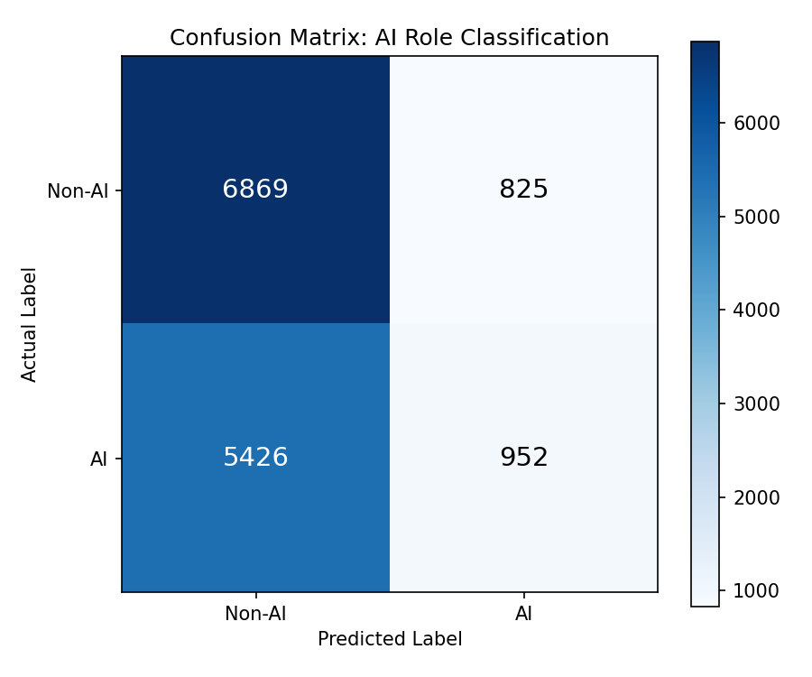

# Predictive Modeling

## Overview

This section applies three machine learning models to the cleaned Lightcast dataset: a linear regression model to predict salary, a logistic regression model to classify AI versus non-AI roles, and a KMeans clustering model to identify natural salary tiers across the job market. Together these models help quantify how job characteristics relate to compensation and AI demand.

## Regression Model: Predicting Salary

### Objective

The goal of this model is to predict the midpoint salary of a job posting based on observable job characteristics.

### Feature Justification

Two versions of the model were tested. The first used industry, remote work type, and AI role flag as features. The second added occupation category and years of experience. Occupation category was expected to be the strongest predictor because salary varies substantially across professional fields regardless of industry.

### Results

| Model | Features | RMSE | R2 |
|---|---|---|---|
| Model 1 | Industry, Remote Type, AI Flag | $31,428 | 0.0094 |
| Model 2 | + Occupation, Experience | $30,040 | 0.0949 |

### Interpretation

Adding occupation category and experience improved R2 from 0.009 to 0.095 and reduced RMSE by roughly $1,400. However, the overall explanatory power remains modest. This is expected given that salary is also shaped by factors not present in this dataset, such as company size, specific technical skills, education level, and negotiation. The low R2 is itself a finding worth noting: structured job characteristics explain only a small portion of salary variance, which suggests that individual and firm level factors play a larger role in determining compensation.

## Classification Model: Predicting AI vs Non-AI Roles

### Objective

This model attempts to classify whether a job posting is AI-related based on industry, remote work type, and occupation category.

### Results

| Metric | Score |
|---|---|
| Accuracy | 55.6% |
| F1 Score | 0.48 |
| AUC | 0.54 |

### Confusion Matrix

The confusion matrix shows that the model correctly identifies most non-AI roles (6,869 true negatives) but misclassifies the majority of actual AI roles as non-AI (5,426 false negatives). This pattern reflects the core finding that AI roles are not structurally distinguishable from non-AI roles based on industry, remote type, and occupation category alone.

### Interpretation

The model performs only slightly better than random guessing. This finding is informative rather than disappointing. It suggests that AI-related roles are spread across industries and occupation categories rather than being concentrated in obvious segments. The distinction between AI and non-AI roles lives primarily in the specific skills and title language of the posting, not in its structural characteristics.

## KMeans Clustering: Salary Tiers

### Objective

KMeans clustering was used to identify natural groupings in the job market based on industry, occupation, salary, and AI role status. Four clusters were specified based on the expectation that the market would segment into entry, mid, upper mid, and senior tiers.

### Results

| Cluster | Avg Salary (Non-AI) | Avg Salary (AI) | Job Count |
|---|---|---|---|
| Entry Level | $47,270 | $50,670 | 4,601 |
| Mid Level | $82,528 | $82,259 | 7,700 |
| Upper Mid Level | $114,743 | $114,707 | 51,215 |
| Senior Level | $177,965 | $180,191 | 7,359 |

### Interpretation

The clustering produced four well-separated salary tiers that are intuitive and interpretable. The most striking pattern is that within every cluster, AI and non-AI roles earn nearly identical average salaries. The salary tier a job belongs to is determined by its occupation and industry profile, not by whether it involves AI. This finding is consistent across all three models and forms the central conclusion of this analysis: AI designation alone does not drive salary. Structural job characteristics and market positioning matter more.
